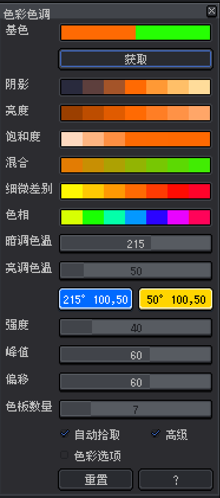
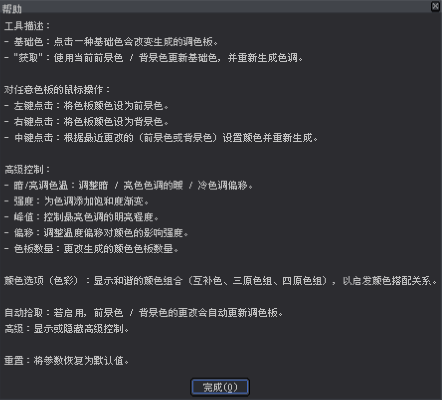

# Aseprite 色彩色调 v5.0

这个适用于Aseprite的脚本会打开一个动态颜色选择窗口，带有相关的渐变和色调选项，帮助你轻松创建调色板和阴影变化。

## 致谢与来源

本作品基于前人的贡献：

- 1.0 - 2.0 版本由多米尼克・约翰和大卫・卡佩洛创作。
- 3.0 版本由yashar98创作。
- 3.1 版本由Daeyangae创作。
- 4.0 版本由曼努埃尔・赫尔茨尔创作。

此版本在保留先前引入功能的同时进行了更多改进。

## 安装

1. 下载脚本文件（例如Color Shading v4.0.lua）。
2. 打开 Aseprite，依次点击文件 -> 脚本 -> 打开脚本文件夹，打开脚本目录。
3. 将脚本文件复制到 Aseprite 的脚本文件夹中。
4. 如有必要，重启 Aseprite。

## 使用方法

1. 在 Aseprite 中，依次点击文件 -> 脚本 -> Color Shading v4.0来运行脚本。
2. 一个带有不同颜色区域和调色板生成选项的窗口将会出现。

### 功能：

- 基础色：点击其中一种基础色，将基于该颜色重新计算其余的色调和细微差别。
- “获取” 按钮：使用当前前景色（FG）和背景色（BG）更新基础色，并重新生成色调。
- 左键点击颜色：将该颜色设置为前景色。
- 右键点击颜色：将该颜色设置为背景色。
- 中键点击颜色：根据上次更改的是前景色还是背景色（如果 “自动选择” 已启用）在两者之间切换，并基于新颜色重新生成所有色调。

### 高级控制：

- 色温（暗 / 亮）：分别调整深色和浅色阴影的暖 / 冷色调偏移。
- 强度：为色调色板添加饱和度渐变。
- 峰值：为色调添加亮度渐变，影响较浅色板变亮的程度。
- 偏移：调整设定温度对最终颜色的影响强度。
- 色板数量：更改生成的颜色色板数量。

## 注意事项

- 确保你拥有 Aseprite 的最新版本以保证脚本兼容性。
- 此脚本适用于需要快速生成调色板和颜色渐变工具的像素艺术家和设计师。

## 🌐 其他语言

- 🇫🇷 [French Version](shadow/README/README-FR.md)
- 🇪🇸 [Spanish Version](shadow/README/README-ES.md)
- 🇯🇵 [Japanese Version](shadow/README/README-JA.md)
- 🇵🇹 [Portuguese Version](shadow/README/README-PT.md)
